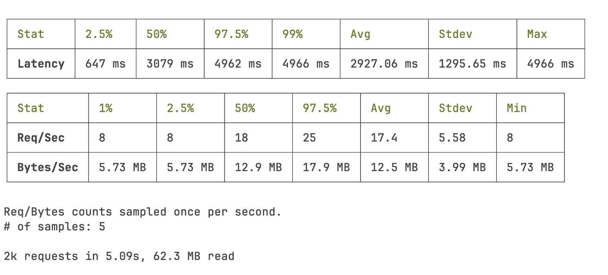
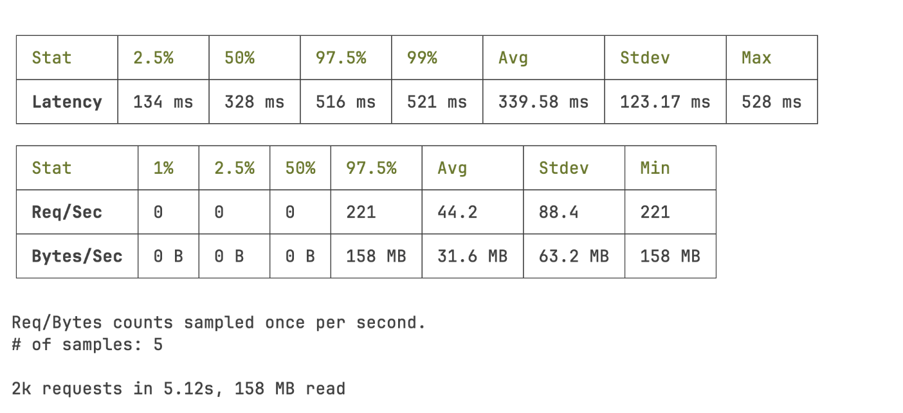

<Lead>
  {`Not so long ago, I was working on a survey builder app that relied heavily on SSR. Then a campaign launched—and things didn’t go as expected. Errors started appearing, users complained about performance, and I was tasked with figuring out what was happening and how to fix it.`}
</Lead>


<div class="bg-secondary-400 border-l-accent border-l-4 dark:bg-primary-400 text-foreground font-mono rounded-xs px-4 py-2">
I'm currently looking for my next role. If this post resonates, feel free to <a href="mailto:diego@geutstudio.com" class="underline hover:font-bold underline-offset-4 ">reach out</a>.
</div>

## The Background

I was working at Alliants as a staff augmentation engineer alongside other Geut team members. We inherited a project from another consultancy company. Not the ideal scenario, but it happens. 

We analyzed the codebase and started shipping new features right away as the client wanted.

Everything seemed fine. The client was happy, and they decided to launch a large email campaign promoting the app and the new features. 

The app was server side rendered and effectively consisted of two apps:

- A marketing/content site explaining the survey builder and its use cases  
- The survey builder itself, a complex app with custom components and multi-user support (org admins and creators)

## The Campaign

Once the campaign launched, issues started surfacing. Errors increased and users reported slow performance.

I was tasked with investigating and providing both a diagnosis and a plan.

From the initial reports, this clearly looked like a performance issue. Specifically, a load issue. So I started measuring everything. That's step one in any performance investigation: establish a baseline before making changes.

To simulate production load, I used [autocannon](https://github.com/mcollina/autocannon#readme). But simply firing a large number of concurrent requests isn’t realistic—you need to simulate traffic ramp-up.

So I built a custom script to progressively increase load over time and simulate user navigation across multiple routes:

```js
import autocannon from 'autocannon'

// Helper function to run autocannon with specified options
function runAutocannon(url, connections, duration, callback) {
  autocannon(
    {
      url,
      connections,
      duration,
      pipelining: 1,
      skipAggregateResult: true,
      requests: [
        { method: 'GET', path: '/' },
        { method: 'GET', path: '/research' },
        { method: 'GET', path: '/products' },
      ],
    },
    callback,
  )
}

// Sequentially run autocannon with increasing connections
function runSequentialTests(url) {
  const phases = [
    { connections: 100, duration: 30 }, // Warmup
    { connections: 500, duration: 60 }, // Continue warmup
    { connections: 5000, duration: 60 }, // Ramp to 5K
    { connections: 10000, duration: 90 }, // Ramp to 10K
    { connections: 20000, duration: 45 }, // Peak at 20K
    { connections: 100, duration: 30 }, // Cool down
  ]

  let currentPhase = 0
  const results = []

  function nextPhase() {
    if (currentPhase < phases.length) {
      const { connections, duration } = phases[currentPhase]
      console.log(
        `Starting phase ${currentPhase + 1}: ${connections} connections for ${duration} seconds`,
      )
      runAutocannon(url, connections, duration, (err, result) => {
        if (err) {
          console.error('Error during test:', err)
        } else {
          console.log(`Phase ${currentPhase + 1} completed`)
          results.push(result)
          currentPhase++
          nextPhase()
        }
      })
    } else {
      console.log('--------------------------------')
      console.log('All phases completed')
      console.log(
        autocannon.aggregateResult(results, { url, title: 'Stress Test' }),
      )
      console.log('--------------------------------')
    }
  }

  nextPhase()
}

// Start the test
const url = process.argv[2]
if (!url) {
  console.error('Please provide a URL')
  process.exit(1)
}

runSequentialTests(url)
```

We also prepared a staging environment similar to production and ran the tests. This gave us a solid baseline.

## The Fixes

Since the app relied heavily on SSR, the main goal was to reduce server work.

The app was built with Nuxt, so I started by shifting some computations to the client. Nuxt provides a `<ClientOnly>` component to explicitly move rendering to the client when appropriate.

Next, I looked into the rendering strategy. Nuxt (via Nitro) supports **hybrid rendering**.

Some routes were essentially static, so prerendering them reduced CPU load significantly. Rendering a page on every request is a CPU intensive task.

After these changes, performance improved. But it still wasn't enough.

While talking with the devops team, I realized the production machines had multiple CPU cores—but the app was only using one. Classic single-threaded Node.js setup.

Digging into Nitro’s docs, I found built-in support for clustering.

```bash
ENV NITRO_PRESET=node-cluster
```

By enabling cluster mode, the app could utilize all available CPU cores. Worker count defaults to the number of cores but can be configured via `NITRO_CLUSTER_WORKERS`.

This change had a major impact.

The system was now able to **handle 159% more requests per second**, and average latency dropped from 2927.06ms to 339.17ms (**~88% reduction**).

### Before


### After


  
## Conclusion

The fixes were merged, and the next campaign ran smoothly.

One important side effect: **infrastructure costs decreased**. Previously, the system relied on scaling out (more instances) rather than optimizing performance.

Simply adding more instances isn’t always the solution—especially for burst traffic. Autoscaling takes time, and coordinating pre-scaling across teams (marketing, infra) is complex.

A key takeaway is understanding when SSR is the right choice versus static generation.

Hybrid rendering is often the best approach. In some cases, separating concerns into different apps (e.g., marketing site vs app) is even better.

Initially, combining everything into one app made sense. But as the app evolved, the separation became clearer.

In short:

- Hybrid rendering is a powerful strategy for legacy apps
- Clustering allows you to fully utilize your resources
- Performance work is often about removing unnecessary work

> SSR is not inherently slow. But it becomes expensive under load if you treat every route as dynamic.

